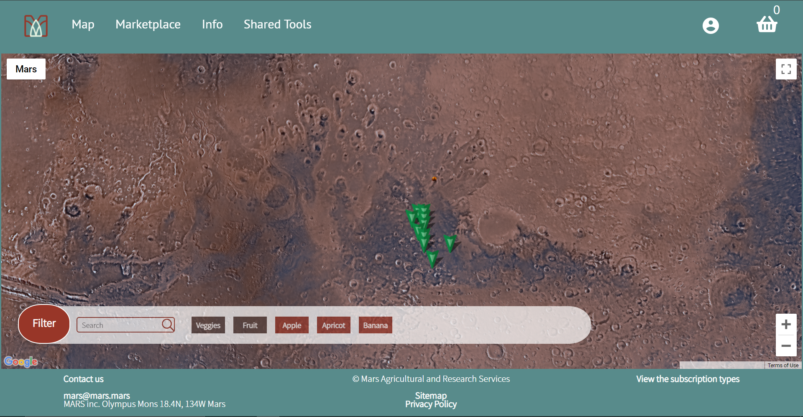
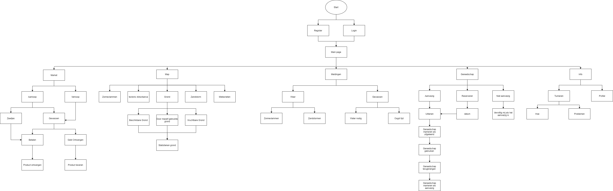

# Mars Agriculture and Research Service (groep 14)
*door Timo De Clercq, Annelin De Gols, Robin De Kinders Laurens Giesen, Cedric Puystjens*

#TODOS VOOR WE INDIENEN - NIET VERGETEN TE VERWIJDEREN

- Gekende bugs - client & server.
  server: Gekende bugs voor readme.md --> server crash bij het verwijderen van een product als deze in de basket/ fav zit
- links in onderdeel "information" werken niet.
- Client: wat is de default user flow? Er staat wel een flowchart, maar highlight daar dan default user flow op.
- Client: is er een bepaalde resolutie waarop we jullie project best bekijken? 1920 1080
- Client: is er een test account beschikbaar met bepaalde credentials waarmee ik direct aan de slag kan?
- server: is er geen database aanwezig in jullie project? Lijkt me sterk gezien dir een requirement is. In de readme zeker: link naar population script + how to install it, beschrijving van de tabellen.
- server: zijn er endpoints die jullie nog niet hebben uitgewerkt? Dan dienen die opgelijst te worden + link naar documentatie openAPI.
- readme informatie op client en server repo's is obsolete: ga daar nog eens grondig door want je verwijst ernaar om dit te gebruiken voor installatie maar kloppen dus niet meer.


[](https://sonar.ti.howest.be/sonar/dashboard?id=2020.project-ii%3Amars-client-14) [](https://sonar.ti.howest.be/sonar/dashboard?id=2020.project-ii%3Amars-server-14)


<br></br>

---
##Inhoudstafel

* [Beschrijving](#beschrijving)
* [POC](#poc)
* [Flowchart](#flowchart)
* [Wireframes](#wireframes)
* [Geïmplementeerde technische vereisten](#gemplementeerde-technische-vereisten)
* [Uitzonderlijke features](#uitzonderlijke-features)
* [Bonuspunten](#bonuspunten)
* [Server](#server)
  + [Informatie](#informatie)
  + [Installatie](#installatie)
  + [Configuratie](#configuratie)
* [Client](#client)
  + [Informatie](#informatie-1)
  + [Installatie](#installatie-1)
  + [Configuratie](#configuratie-1)
<br><br>

---
## Beschrijving

Al snel werd het duidelijk dat we het probleem van voedselschaarste wilden
aanpakken. Het zou zinloos zijn als je steeds moet wachten op de volgende levering
voedsel van Aarde naar Mars. Met ons concept Mars Agricultural Research Service
(verder afgekort als MARS) proberen we mensen samen te brengen om een
autonome samenleving te creëren op vlak van voedsel.
<br><br>

---
##POC
ik mis een feature lijst van de POC (dat mag op de docs repo). Wat DOET jullie applicatie? Zijn er delen niet in de POC maar wel in de wireframes?  
<br><br>

---
## Flowchart
### Flowchart van het afgeleverde project


### Flowchart zoals opgesteld bij aanvang project

<br><br>

---
## Wireframes
De wireframes zelf werden niet meer aangepast, maar de feedback werd wel rechtstreeks geïmplementeerd.

__Wireframes via adobe XD:__

* [Wireframes: presentatie](https://xd.adobe.com/view/d7e4c552-f993-47b6-a815-8bf2913cfd7e-82b7/?fullscreen)
* [Wireframes: developer](https://xd.adobe.com/view/d7e4c552-f993-47b6-a815-8bf2913cfd7e-82b7/)
<br><br>

---
##Geïmplementeerde technische vereisten
###Map
###Vue
###CSS Animaties
<br><br>

---
##Uitzonderlijke features
Uitzonderlijke feature(s) die jullie onderscheiden van de anderen / waar jullie trots op zijn
<br><br>

---
## Bonuspunten
### Usertesting

Afgenomen via Userbrain
De eerste, en helaas enige usertest werd afgenomen op 19/11/2020 o.b.v. de zo goed als volledig opgestelde wireframes.

[Verslag (Google Drive)](https://drive.google.com/file/d/1mCiJKZwMsS4eZQXjr-O-3Qmgq6opT49_/view?usp=sharing)
<br><br>

---
## Server
### Informatie
Om de server op te zetten start je met het [Clonen](#installatie) van de server. Als de server succesvol gecloned is kan je deze [configureren](#configuratie) in de **conf/config.json**. Hier moet je een poort specifiëren waarop je de server wilt draaien. In deze configuratie file kan u ook de gegevens voor de database wijzigen. In de file: [MarsOpenApiBridge](https://git.ti.howest.be/TI/2020-2021/s3/project-ii/projects/groep-14/server/-/blob/master/src/main/java/be/howest/ti/mars/webserver/MarsOpenApiBridge.java) worden alle requests afgehandeld die in de [OpenAPI File](https://git.ti.howest.be/TI/2020-2021/s3/project-ii/projects/groep-14/server/-/blob/master/src/main/resources/openapi-group-14.yaml) omschreven zijn. Deze file staat in contact met de [MarsController](https://git.ti.howest.be/TI/2020-2021/s3/project-ii/projects/groep-14/server/-/blob/master/src/main/java/be/howest/ti/mars/logic/controller/MarsController.java), in deze MarsController worden de repo's aangemaakt waarmee we zaken kunnen doen zoals gebruikers aanmaken, gewassen oplijsten, ...
<br>
### Installatie
```
git clone git@git.ti.howest.be:TI/2020-2021/s3/project-ii/projects/groep-14/server.git

```
Of
``` 
git clone https://git.ti.howest.be/TI/2020-2021/s3/project-ii/projects/groep-14/server.git

```


### Configuratie

**Path: conf/config.json**

```json

{
  "http": {
    "port": 8080
  },
  "db" : {
    "url": "jdbc:h2:~/mars-db",
    "username": "group-14",
    "password": "t3sfe1k3nUe",
    "webconsole.port": 9000
  }
}

```
<br>

---
## Client 
### Informatie

Als u de repository mooi binnengehaald hebt via git clone, dan kunt u alle files geordend zien. In [assets](https://git.ti.howest.be/TI/2020-2021/s3/project-ii/projects/groep-14/client/-/tree/master/src/assets) bevinden zich alle css-files, javascript-files en images. Als u onze [index.html](https://git.ti.howest.be/TI/2020-2021/s3/project-ii/projects/groep-14/client/-/blob/master/src/index.html) in de browser opent, kan u de volledige client-side ervaren. Aan de hand van requests die zich bevinden in de javascript-files, communiceert onze client met de server (Java). De code wordt gecontroleerd via [SonarLint](https://sonar.ti.howest.be/sonar/projects?search=14+mars). Dit is een tool die fouten/bugs zoekt in onze code. In de [package.json](https://git.ti.howest.be/TI/2020-2021/s3/project-ii/projects/groep-14/client/-/blob/master/package.json) zitten alle scripts die de code valideren. Zo zijn we verplicht om kwaliteitsvolle code te schrijven.
<br>
### Installatie

```
git clone git@git.ti.howest.be:TI/2020-2021/s3/project-ii/projects/groep-14/client.git

```
Of

``` 
git clone https://git.ti.howest.be/TI/2020-2021/s3/project-ii/projects/groep-14/client.git
```
### Configuratie

**Path: Client/src/config.json**
```json
{
  "host": "http://localhost:8080",
  "folder": "",
  "group": "mars-14"
}

```

## OpenAPI